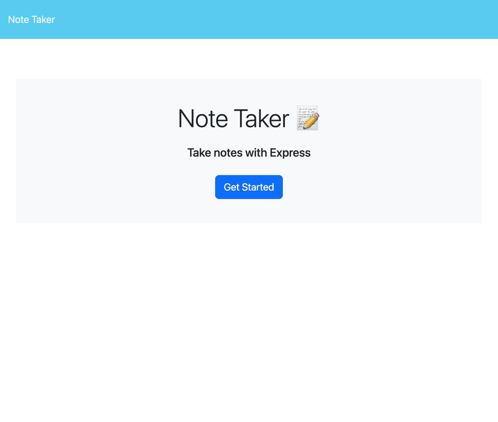
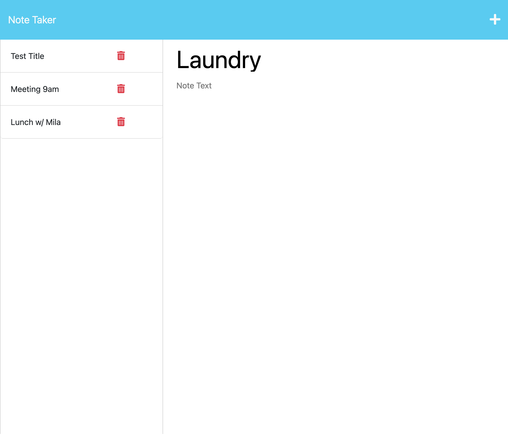

# Note-Tracker-Express.js

## Description

The Note Taker app is a simple web-based application that allows users to create, save, view and delete notes. Ready-to-use for taking and organizing your notes. Back-end implementation were added using Express.js and deployed on Heroku.

## Link
https://warm-waters-82468-df0ff9e0cf48.herokuapp.com/

## Features
Create and save notes with a title and content.
View a list of existing notes.
Click on a note to view or edit its content.
Delete unwanted notes.

## Installation
Clone git repository https://github.com/alexandrazykova/Note-Tracker-Express.js

Open integrated terminal

Run command - npm install 

Run command - npm start

Follow localhost link 

## Technologies Used

Html

Css

JavaScript

Node.js

Express.js

Heroku

## Screenshot

## Questions?

GitHub: https://github.com/alexandrazykova
Email: alexandrazykova1@gmail.com

